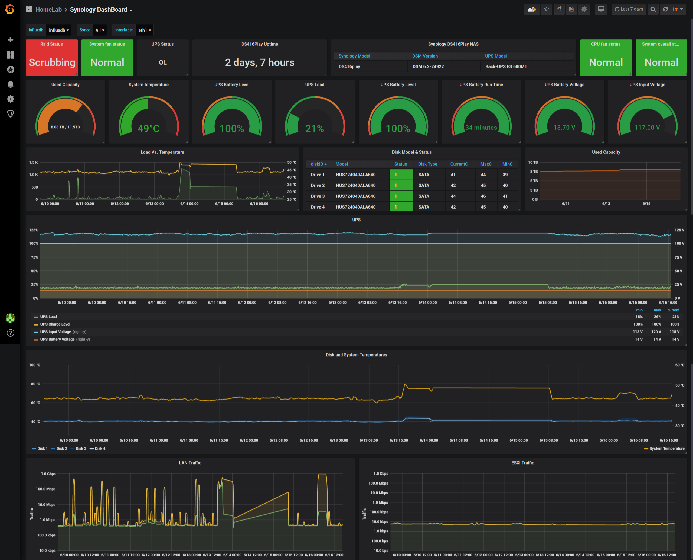

# Monitor Synology

## Screenshots:

Synology Dashboard


## **Synology NAS**

Based on:
- https://github.com/jperillo/Synology_dashboard_grafana
- https://github.com/chvvkumar/Monitoring

## **Running**
```bash
docker create \
  --name=synology-telegraf \
  -e SYNOLOGY_HOST=synology.local \
  -e INFLUX_URL=influx.local \
  -e SYNOLOGY_COMMUNITY=public \
  --restart unless-stopped \
  demonemia/synology-telegraf
```